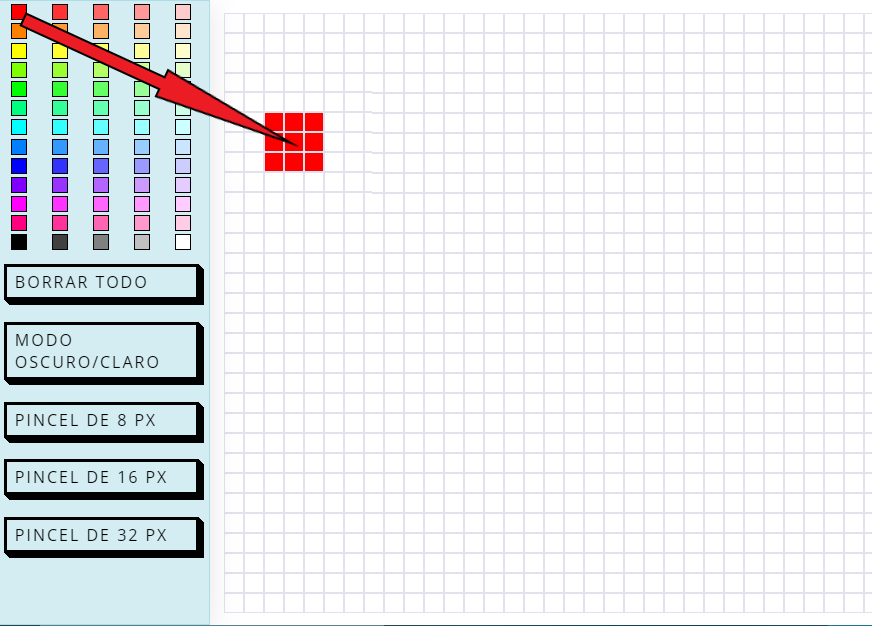
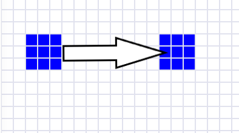
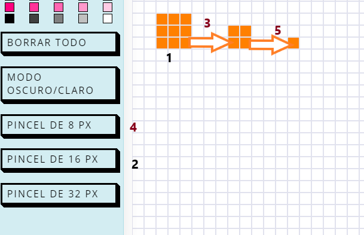
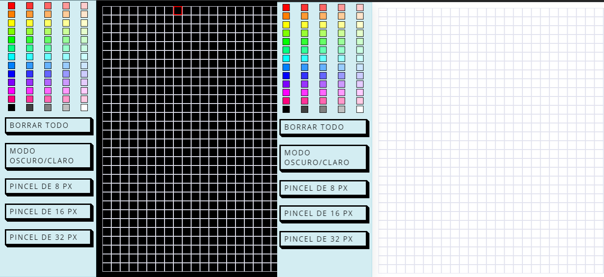
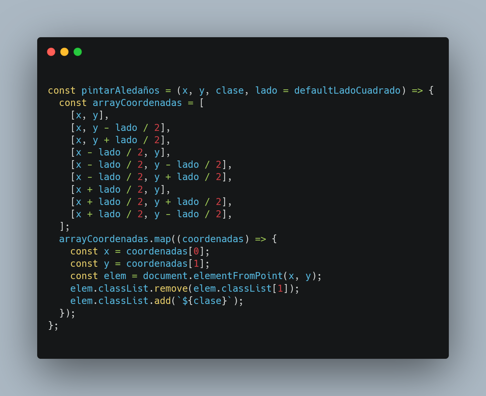

    

# Cuadricula de dibujo.

## Índice

- [Cuadricula de dibujo.](#cuadricula-de-dibujo)
  - [Índice](#índice)
  - [Descripción](#descripción)
  - [Inicio y final](#inicio-y-final)
  - [Para empezar](#para-empezar)
    - [Prerrequisitos](#prerrequisitos)
    - [Deployment](#deployment)
  - [Uso](#uso)
  - [Bugs conocidos](#bugs-conocidos)
  - [Mejoras](#mejoras)
  - [Licencia](#licencia)
  - [Contacto](#contacto)

## Descripción

Cuadrícula de dibujo que te permite arrastrar cubos de colores de distintos tamaños y crear composiciones sencillas.
Este proyecto es el entregable final del Bootcamp de programación impartido por
<a href="https://geekshubsacademy.com/">GeeksHubs academy</a> y realizado en <a href="https://www.urbalabgandia.com/es/inicio/">Urbalab Gandia</a> en septiembre de 2022.

## Inicio y final

Primer commit realizado el día 20/09/2022.
Último commit realizado el día 30/09/2022.

## Para empezar

Este es un sencillo proyecto realizado con Vainilla JS.

### Prerrequisitos

Navegador web.

### Deployment

https://iminguet.github.io/dinamicShowCase

## Uso

Para empezar a dibujar, primero elige el tamaño del pincel de entre las opciones que se dan en la parte inferior izquierda de la aplicación.

Arrastra el color que quieras a la cuadricula y suelta, el color se ubicará en relación al puntero del ratón.

Si quieres replicar ese color, puedes arrastrar desde ese mismo elemento y al soltar, de igual forma, pintará la cuadricula.

Tambien puedes cambiar el tamaño del pincel antes de arrastrar.

El programa admite que los colores se superpongan.

Cambia entre modo oscuro y modo claro pulsando el botón "MODO OSCURO/CLARO".

Pulsa borrar para... oh si, borrar toda la cuadricula.

## Bugs conocidos

Al usar un posicionamiento por coordenadas X/Y respecto al puntero del ratón, el usuario puede encontrar que en ocasiones la respuesta no es la esperada. El cálculo de coordenadas está realizado manualmente y al programa se le indica que añada la clase al elemento que se encuentra en esa misma posición. Así que dependiendo de en que zona del cuadro pequeño se realice el drop, el mismo pincel puede arrojar distintos resultados.

## Mejoras

Correción de bugs.
Se implementará la funcionalidad del dibujo en sí, sin el uso de cuadrículas sobre las que ahora mismo añadimos clases.
Se implementará que al activar el evento de arrastre, se pinte todo a su paso.

## Licencia

<a href="https://creativecommons.org/publicdomain/zero/1.0/">Creative Commons Zero v1.0 Universal</a>

## Contacto

 
